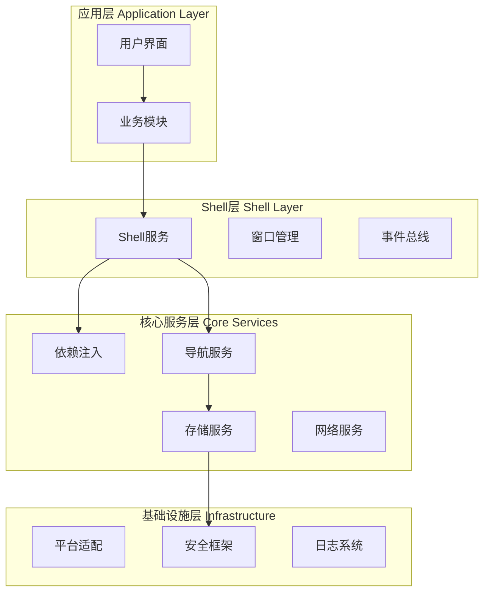

# 模块API规范 v1.0

**文档版本**: v1.0  
**创建日期**: 2025-06-28  
**作用范围**: Phase 2.2+ 模块开发标准  
**关联文档**: [Shell-Module交互契约 v1.0](./shell_module_contract_v1.md)

## 概述

本文档定义了桌宠AI助理平台模块开发的完整API规范，为第三方开发者和内部团队提供模块开发的标准指南。

### 规范目标

1. **标准化开发流程**: 统一模块开发的接口、结构和质量标准
2. **降低开发门槛**: 提供清晰的API文档和开发指南
3. **确保生态一致性**: 保证所有模块与平台核心的兼容性
4. **促进开放创新**: 为第三方开发者创建友好的开发环境

## 1. 核心架构概述

### 1.1 平台架构层次



### 1.2 模块在架构中的位置

模块位于应用层，通过标准化的Shell服务接口与平台核心进行交互，享受平台提供的基础设施服务。

## 2. Shell-Module交互契约

### 2.1 契约文档引用

**📋 核心规范**: 模块与Shell的交互必须严格遵循 **[Shell-Module交互契约 v1.0](./shell_module_contract_v1.md)**。

该契约文档详细定义了：

- **标准通信接口**: `ModuleContract`、`ShellContext`等核心接口规范
- **服务请求机制**: 窗口管理、通知、导航等Shell服务的使用方法
- **事件响应系统**: Shell生命周期、主题变更、显示模式切换等事件处理
- **权限模型**: 7种模块权限类型和权限管理机制
- **数据交换标准**: `ModuleDataPacket`等标准数据格式
- **版本兼容策略**: 向前兼容和API演进策略

### 2.2 契约集成要点

在开发模块时，开发者必须：

1. **实现ModuleContract接口**：每个模块都必须实现完整的`ModuleContract`接口
2. **声明所需权限**：明确声明模块需要的权限类型
3. **遵循事件处理规范**：正确处理Shell事件并响应生命周期变化
4. **使用标准数据格式**：模块间通信必须使用`ModuleDataPacket`标准格式
5. **测试契约兼容性**：编写契约兼容性测试确保符合规范

### 2.3 快速上手指南

```dart
// 1. 实现基础模块结构
class MyModule implements ModuleContract {
  @override
  String get moduleId => 'com.company.mymodule';
  
  @override
  Set<ModulePermission> get requiredPermissions => {
    ModulePermission.windowManagement,
    ModulePermission.systemNotification,
  };
  
  @override
  Future<void> initialize(ShellContext context) async {
    // 模块初始化逻辑
  }
  
  @override
  void handleShellEvent(ShellEvent event) {
    // 处理Shell事件
  }
}

// 2. 请求Shell服务
void requestWindowService(ShellContext context) {
  final windowService = context.getService<WindowManagementService>();
  windowService.openFloatingWindow(
    title: '我的窗口',
    initialSize: const Size(400, 300),
    content: MyModuleWidget(),
  );
}
```

## 3. 模块开发标准

### 3.1 模块结构规范

#### 标准目录结构
```
my_module/
├── lib/
│   ├── my_module.dart              # 主入口文件
│   ├── src/
│   │   ├── module_impl.dart        # ModuleContract实现
│   │   ├── widgets/                # UI组件
│   │   ├── services/               # 模块内部服务
│   │   └── models/                 # 数据模型
├── test/
│   ├── module_contract_test.dart   # 契约兼容性测试
│   └── widget_test.dart            # UI测试
├── pubspec.yaml                    # 依赖配置
└── README.md                       # 模块文档
```

#### 入口文件规范
```dart
// lib/my_module.dart
library my_module;

export 'src/module_impl.dart';
export 'src/widgets/my_module_widget.dart';

// 模块元数据
const String moduleId = 'com.company.mymodule';
const String moduleVersion = '1.0.0';
const String moduleDisplayName = '我的模块';
```

### 3.2 依赖管理规范

#### pubspec.yaml标准配置
```yaml
name: my_module
description: 我的桌宠AI助理模块
version: 1.0.0

environment:
  sdk: '>=3.0.0 <4.0.0'
  flutter: ">=3.10.0"

dependencies:
  flutter:
    sdk: flutter
  # 平台核心依赖
  core_services:
    path: ../../packages/core_services
  # 其他必要依赖
  rxdart: ^0.27.7

dev_dependencies:
  flutter_test:
    sdk: flutter
  flutter_lints: ^2.0.0

flutter:
  uses-material-design: true
```

#### 依赖注入集成
```dart
class MyModuleImpl implements ModuleContract {
  late final MyModuleService _service;
  late final ShellContext _shellContext;
  
  @override
  Future<void> initialize(ShellContext context) async {
    _shellContext = context;
    
    // 注册模块内部服务
    serviceLocator.registerLazySingleton<MyModuleService>(
      () => MyModuleService(),
    );
    
    _service = serviceLocator.get<MyModuleService>();
    await _service.initialize();
  }
}
```

### 3.3 UI开发规范

#### Material Design 3集成
```dart
class MyModuleWidget extends StatelessWidget {
  @override
  Widget build(BuildContext context) {
    final theme = Theme.of(context);
    
    return Card(
      elevation: 2,
      child: Padding(
        padding: const EdgeInsets.all(16.0),
        child: Column(
          crossAxisAlignment: CrossAxisAlignment.start,
          children: [
            Text(
              '模块标题',
              style: theme.textTheme.headlineSmall,
            ),
            const SizedBox(height: 8),
            Text(
              '模块内容',
              style: theme.textTheme.bodyMedium,
            ),
            const SizedBox(height: 16),
            FilledButton(
              onPressed: _handleAction,
              child: const Text('执行操作'),
            ),
          ],
        ),
      ),
    );
  }
}
```

#### 响应式布局适配
```dart
class ResponsiveModuleWidget extends StatelessWidget {
  @override
  Widget build(BuildContext context) {
    return LayoutBuilder(
      builder: (context, constraints) {
        if (constraints.maxWidth > 600) {
          return _buildDesktopLayout();
        } else {
          return _buildMobileLayout();
        }
      },
    );
  }
  
  Widget _buildDesktopLayout() {
    return Row(
      children: [
        Expanded(flex: 2, child: _buildLeftPanel()),
        Expanded(flex: 3, child: _buildMainContent()),
      ],
    );
  }
  
  Widget _buildMobileLayout() {
    return Column(
      children: [
        _buildMainContent(),
        _buildBottomPanel(),
      ],
    );
  }
}
```

## 4. 数据管理规范

### 4.1 状态管理

#### 推荐使用RxDart
```dart
class MyModuleState {
  final BehaviorSubject<List<Item>> _itemsSubject = BehaviorSubject.seeded([]);
  final BehaviorSubject<bool> _loadingSubject = BehaviorSubject.seeded(false);
  
  Stream<List<Item>> get items => _itemsSubject.stream;
  Stream<bool> get loading => _loadingSubject.stream;
  
  void updateItems(List<Item> items) {
    _itemsSubject.add(items);
  }
  
  void setLoading(bool loading) {
    _loadingSubject.add(loading);
  }
  
  void dispose() {
    _itemsSubject.close();
    _loadingSubject.close();
  }
}
```

#### 与平台数据层集成
```dart
class MyModuleService {
  final IPersistenceRepository _repository;
  
  MyModuleService(this._repository);
  
  Future<List<MyItem>> loadItems() async {
    try {
      final data = await _repository.getAll<MyItem>('my_items');
      return data;
    } catch (e) {
      // 错误处理
      throw ModuleDataException('Failed to load items: $e');
    }
  }
  
  Future<void> saveItem(MyItem item) async {
    await _repository.create('my_items', item.id, item.toJson());
  }
}
```

### 4.2 数据模型规范

#### 标准数据模型结构
```dart
class MyItem {
  final String id;
  final String title;
  final String description;
  final DateTime createdAt;
  final DateTime updatedAt;
  
  MyItem({
    required this.id,
    required this.title,
    required this.description,
    required this.createdAt,
    required this.updatedAt,
  });
  
  factory MyItem.fromJson(Map<String, dynamic> json) => MyItem(
    id: json['id'],
    title: json['title'],
    description: json['description'],
    createdAt: DateTime.parse(json['createdAt']),
    updatedAt: DateTime.parse(json['updatedAt']),
  );
  
  Map<String, dynamic> toJson() => {
    'id': id,
    'title': title,
    'description': description,
    'createdAt': createdAt.toIso8601String(),
    'updatedAt': updatedAt.toIso8601String(),
  };
  
  MyItem copyWith({
    String? title,
    String? description,
    DateTime? updatedAt,
  }) => MyItem(
    id: id,
    title: title ?? this.title,
    description: description ?? this.description,
    createdAt: createdAt,
    updatedAt: updatedAt ?? this.updatedAt,
  );
}
```

## 5. 国际化支持

### 5.1 ARB文件配置

#### 模块专用ARB文件
```json
// lib/l10n/my_module_en.arb
{
  "myModuleTitle": "My Module",
  "myModuleDescription": "This is my custom module",
  "actionButton": "Execute Action",
  "loadingMessage": "Loading...",
  "errorMessage": "An error occurred: {error}",
  "@errorMessage": {
    "placeholders": {
      "error": {
        "type": "String"
      }
    }
  }
}
```

```json
// lib/l10n/my_module_zh.arb
{
  "myModuleTitle": "我的模块",
  "myModuleDescription": "这是我的自定义模块",
  "actionButton": "执行操作",
  "loadingMessage": "加载中...",
  "errorMessage": "发生错误：{error}"
}
```

#### 国际化集成代码
```dart
import 'package:flutter_localizations/flutter_localizations.dart';
import 'package:flutter_gen/gen_l10n/my_module_localizations.dart';

class MyModuleWidget extends StatelessWidget {
  @override
  Widget build(BuildContext context) {
    final l10n = MyModuleLocalizations.of(context)!;
    
    return Column(
      children: [
        Text(l10n.myModuleTitle),
        Text(l10n.myModuleDescription),
        ElevatedButton(
          onPressed: _handleAction,
          child: Text(l10n.actionButton),
        ),
      ],
    );
  }
}
```

## 6. 测试规范

### 6.1 契约兼容性测试

```dart
// test/module_contract_test.dart
import 'package:flutter_test/flutter_test.dart';
import 'package:my_module/my_module.dart';

void main() {
  group('Module Contract Compliance', () {
    late MyModuleImpl module;
    
    setUp(() {
      module = MyModuleImpl();
    });
    
    test('should have valid module metadata', () {
      expect(module.moduleId, isNotEmpty);
      expect(module.displayName, isNotEmpty);
      expect(module.version, matches(RegExp(r'^\d+\.\d+\.\d+$')));
      expect(module.requiredPermissions, isNotEmpty);
    });
    
    test('should initialize without errors', () async {
      final mockContext = MockShellContext();
      expect(() => module.initialize(mockContext), returnsNormally);
    });
    
    test('should handle shell events properly', () {
      final event = MockShellEvent();
      expect(() => module.handleShellEvent(event), returnsNormally);
    });
    
    test('should dispose resources cleanly', () async {
      await module.initialize(MockShellContext());
      expect(() => module.dispose(), returnsNormally);
    });
  });
}
```

### 6.2 集成测试

```dart
// test/integration_test.dart
import 'package:flutter_test/flutter_test.dart';
import 'package:integration_test/integration_test.dart';

void main() {
  IntegrationTestWidgetsFlutterBinding.ensureInitialized();
  
  group('Module Integration Tests', () {
    testWidgets('should integrate with shell services', (tester) async {
      // 测试模块与Shell服务的集成
    });
    
    testWidgets('should respond to shell events', (tester) async {
      // 测试模块对Shell事件的响应
    });
  });
}
```

## 7. 部署和分发

### 7.1 模块打包规范

#### 打包配置
```yaml
# build.yaml
targets:
  $default:
    builders:
      flutter_packages|flutter_gen:
        enabled: true
        options:
          output_dir: lib/gen/
      
module_metadata:
  id: com.company.mymodule
  name: My Module
  version: 1.0.0
  description: 我的桌宠AI助理模块
  author: Your Name
  homepage: https://github.com/yourname/my-module
  
  # 兼容性声明
  min_platform_version: 2.1.0
  max_platform_version: 3.0.0
  
  # 权限声明
  permissions:
    - windowManagement
    - systemNotification
  
  # 依赖声明
  dependencies:
    - core_services: ^1.0.0
```

### 7.2 质量检查清单

#### 发布前检查
- [ ] **契约兼容性**: 通过所有契约兼容性测试
- [ ] **代码质量**: Flutter analyze零错误零警告
- [ ] **测试覆盖**: 单元测试覆盖率≥80%
- [ ] **性能测试**: 模块启动时间<500ms
- [ ] **国际化**: 支持中英文双语
- [ ] **文档完整**: README、API文档、使用示例
- [ ] **权限声明**: 正确声明所需权限
- [ ] **版本兼容**: 声明兼容的平台版本范围

## 8. 最佳实践

### 8.1 性能优化

#### 懒加载实现
```dart
class MyModuleImpl implements ModuleContract {
  late final Lazy<ExpensiveService> _expensiveService;
  
  @override
  Future<void> initialize(ShellContext context) async {
    _expensiveService = Lazy(() => ExpensiveService());
    // 不立即初始化耗时服务
  }
  
  Future<void> useExpensiveFeature() async {
    final service = await _expensiveService.value;
    await service.doExpensiveWork();
  }
}
```

#### 内存管理
```dart
class MyModuleImpl implements ModuleContract {
  final List<StreamSubscription> _subscriptions = [];
  
  @override
  Future<void> initialize(ShellContext context) async {
    final subscription = context.listenToShellEvents().listen(handleShellEvent);
    _subscriptions.add(subscription);
  }
  
  @override
  Future<void> dispose() async {
    // 清理所有订阅
    for (final subscription in _subscriptions) {
      await subscription.cancel();
    }
    _subscriptions.clear();
  }
}
```

### 8.2 错误处理

#### 统一错误处理
```dart
class ModuleErrorHandler {
  static void handleError(Object error, StackTrace stackTrace) {
    // 记录错误
    Logger.error('Module error: $error', stackTrace);
    
    // 向Shell报告错误
    final errorEvent = ModuleErrorEvent(
      moduleId: 'com.company.mymodule',
      error: error.toString(),
      stackTrace: stackTrace.toString(),
    );
    eventBus.emit(errorEvent);
  }
}

// 在模块中使用
try {
  await riskyOperation();
} catch (error, stackTrace) {
  ModuleErrorHandler.handleError(error, stackTrace);
}
```

### 8.3 安全考虑

#### 数据验证
```dart
class DataValidator {
  static ValidationResult validateUserInput(String input) {
    if (input.isEmpty) {
      return ValidationResult(isValid: false, errors: ['输入不能为空']);
    }
    
    if (input.length > 1000) {
      return ValidationResult(isValid: false, errors: ['输入过长']);
    }
    
    // XSS防护
    if (input.contains('<script>') || input.contains('javascript:')) {
      return ValidationResult(isValid: false, errors: ['输入包含危险内容']);
    }
    
    return ValidationResult(isValid: true);
  }
}
```

## 9. 开发工具和调试

### 9.1 开发调试工具

#### 模块调试面板
```dart
class ModuleDebugPanel extends StatelessWidget {
  final ModuleContract module;
  
  const ModuleDebugPanel({required this.module});
  
  @override
  Widget build(BuildContext context) {
    return Card(
      child: Column(
        children: [
          Text('模块ID: ${module.moduleId}'),
          Text('版本: ${module.version}'),
          Text('权限: ${module.requiredPermissions.join(', ')}'),
          ElevatedButton(
            onPressed: () => _triggerTestEvent(),
            child: const Text('触发测试事件'),
          ),
        ],
      ),
    );
  }
}
```

### 9.2 性能监控集成

```dart
class PerformanceMonitor {
  static void trackModulePerformance(String moduleId, String operation, Duration duration) {
    final performanceData = {
      'moduleId': moduleId,
      'operation': operation,
      'duration': duration.inMilliseconds,
      'timestamp': DateTime.now().toIso8601String(),
    };
    
    // 发送到性能监控服务
    PerformanceService.track(performanceData);
  }
}
```

## 10. 版本升级指南

### 10.1 API版本兼容性

当平台API发生变化时，模块开发者应：

1. **检查兼容性**: 使用平台提供的兼容性检查工具
2. **更新依赖**: 升级到新版本的`core_services`
3. **适配新接口**: 实现新的接口方法（如有）
4. **测试验证**: 运行完整的测试套件
5. **更新文档**: 更新模块文档和版本号

### 10.2 迁移辅助工具

平台将提供自动化迁移工具协助模块升级：

```bash
# 检查模块兼容性
flutter pub run platform_tools:check_compatibility

# 自动迁移到新版本
flutter pub run platform_tools:migrate --to-version 2.2.0

# 验证迁移结果
flutter pub run platform_tools:validate_migration
```

---

**文档维护者**: Phase 2.1开发团队  
**最后更新**: 2025-06-28  
**下次审查**: Phase 2.2启动前  
**相关资源**: 
- [Shell-Module交互契约 v1.0](./shell_module_contract_v1.md)
- [平台开发者指南](../architecture.md)
- [API参考文档](../APIs/) 