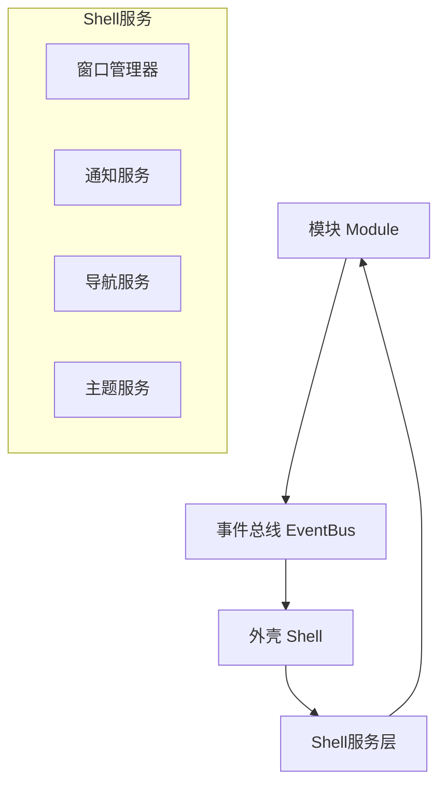

# Shell-Module交互契约 v1.0

**文档版本**: v1.0  
**创建日期**: 2025-06-28  
**作用范围**: Phase 2.1 三端UI框架与开放性设计  
**兼容性**: Phase 2.2+ 模块开发标准  

## 概述

本契约定义了桌宠AI助理平台中Shell（外壳）与Module（模块）之间的标准交互协议，为未来的插件生态和开放性扩展奠定基础。

### 核心设计原则

1. **松耦合架构**: Shell与Module通过标准化接口交互，避免直接依赖
2. **事件驱动通信**: 基于RxDart的响应式事件总线进行异步通信  
3. **权限边界清晰**: 模块只能访问被明确授权的Shell服务
4. **向前兼容**: 接口设计支持版本演进，保证旧模块可用性
5. **跨端一致性**: 契约在PC、移动端、Web三端保持统一

## 1. 核心通信协议

### 1.1 通信架构



### 1.2 标准通信接口

#### ModuleContract 抽象接口
```dart
/// 模块契约接口 - 所有模块必须实现
abstract class ModuleContract {
  /// 模块唯一标识符
  String get moduleId;
  
  /// 模块显示名称
  String get displayName;
  
  /// 模块版本
  String get version;
  
  /// 模块所需权限列表
  Set<ModulePermission> get requiredPermissions;
  
  /// 初始化模块
  Future<void> initialize(ShellContext context);
  
  /// 处理Shell事件
  void handleShellEvent(ShellEvent event);
  
  /// 清理资源
  Future<void> dispose();
}
```

#### ShellContext 外壳上下文
```dart
/// Shell上下文 - 提供给模块的Shell服务访问点
class ShellContext {
  /// 事件总线
  final EventBus eventBus;
  
  /// Shell服务注册表
  final Map<Type, dynamic> _services;
  
  /// 获取Shell服务
  T getService<T>() {
    if (!_hasPermission<T>()) {
      throw PermissionDeniedException('Module lacks permission for service $T');
    }
    return _services[T] as T;
  }
  
  /// 发送事件到Shell
  void sendEvent(ModuleEvent event) {
    eventBus.emit(event);
  }
  
  /// 监听Shell事件
  Stream<ShellEvent> listenToShellEvents() {
    return eventBus.on<ShellEvent>();
  }
}
```

## 2. 服务请求机制

### 2.1 窗口管理服务

```dart
/// 窗口管理服务 - 处理模块的窗口请求
abstract class WindowManagementService {
  /// 打开新的浮动窗口
  Future<WindowHandle> openFloatingWindow({
    required String title,
    required Size initialSize,
    required Widget content,
    WindowConfig? config,
  });
  
  /// 最小化窗口
  Future<void> minimizeWindow(WindowHandle handle);
  
  /// 关闭窗口
  Future<void> closeWindow(WindowHandle handle);
  
  /// 获取当前活跃窗口列表
  List<WindowHandle> getActiveWindows();
}

/// 模块请求打开窗口示例
class ModuleWindowRequest extends ModuleEvent {
  final String title;
  final Size size;
  final Widget content;
  
  ModuleWindowRequest({
    required this.title,
    required this.size, 
    required this.content,
  });
}
```

### 2.2 通知服务

```dart
/// 通知服务 - 处理模块的通知请求
abstract class NotificationService {
  /// 显示系统通知
  Future<void> showNotification({
    required String title,
    required String message,
    NotificationType type = NotificationType.info,
    Duration? duration,
  });
  
  /// 显示应用内通知
  Future<void> showInAppNotification({
    required String message,
    Duration duration = const Duration(seconds: 3),
  });
}

/// 通知类型枚举
enum NotificationType {
  info,
  success,
  warning,
  error,
}
```

### 2.3 导航服务

```dart
/// 导航服务 - 处理模块间的导航请求
abstract class NavigationService {
  /// 导航到指定模块
  Future<void> navigateToModule(String moduleId, {Map<String, dynamic>? params});
  
  /// 返回上一个页面
  Future<void> goBack();
  
  /// 获取当前路由信息
  RouteInfo getCurrentRoute();
}
```

## 3. 事件响应系统

### 3.1 Shell事件类型

```dart
/// Shell事件基类
abstract class ShellEvent {
  final DateTime timestamp;
  final String eventId;
  
  ShellEvent({
    required this.eventId,
    DateTime? timestamp,
  }) : timestamp = timestamp ?? DateTime.now();
}

/// Shell生命周期事件
class ShellLifecycleEvent extends ShellEvent {
  final LifecycleState state;
  
  ShellLifecycleEvent(this.state) : super(eventId: 'shell_lifecycle');
}

enum LifecycleState {
  initialized,
  resumed,
  paused,
  disposing,
}

/// 主题变更事件
class ThemeChangedEvent extends ShellEvent {
  final ThemeData newTheme;
  
  ThemeChangedEvent(this.newTheme) : super(eventId: 'theme_changed');
}

/// 显示模式切换事件
class DisplayModeChangedEvent extends ShellEvent {
  final DisplayMode newMode;
  final DisplayMode previousMode;
  
  DisplayModeChangedEvent({
    required this.newMode,
    required this.previousMode,
  }) : super(eventId: 'display_mode_changed');
}
```

### 3.2 模块事件响应

```dart
/// 模块实现事件响应的示例
class ExampleModule implements ModuleContract {
  @override
  void handleShellEvent(ShellEvent event) {
    switch (event.runtimeType) {
      case ThemeChangedEvent:
        _handleThemeChanged(event as ThemeChangedEvent);
        break;
      case DisplayModeChangedEvent:
        _handleDisplayModeChanged(event as DisplayModeChangedEvent);
        break;
      case ShellLifecycleEvent:
        _handleLifecycleEvent(event as ShellLifecycleEvent);
        break;
    }
  }
  
  void _handleThemeChanged(ThemeChangedEvent event) {
    // 响应主题变更，更新模块UI
  }
  
  void _handleDisplayModeChanged(DisplayModeChangedEvent event) {
    // 响应显示模式切换，调整模块布局
  }
  
  void _handleLifecycleEvent(ShellLifecycleEvent event) {
    // 响应Shell生命周期变化
  }
}
```

## 4. 数据交换规范

### 4.1 标准数据格式

```dart
/// 模块间数据传输标准格式
class ModuleDataPacket {
  final String sourceModuleId;
  final String targetModuleId;
  final String dataType;
  final Map<String, dynamic> payload;
  final DateTime timestamp;
  
  ModuleDataPacket({
    required this.sourceModuleId,
    required this.targetModuleId,
    required this.dataType,
    required this.payload,
  }) : timestamp = DateTime.now();
  
  /// 序列化为JSON
  Map<String, dynamic> toJson() => {
    'sourceModuleId': sourceModuleId,
    'targetModuleId': targetModuleId,
    'dataType': dataType,
    'payload': payload,
    'timestamp': timestamp.toIso8601String(),
  };
  
  /// 从JSON反序列化
  factory ModuleDataPacket.fromJson(Map<String, dynamic> json) => ModuleDataPacket(
    sourceModuleId: json['sourceModuleId'],
    targetModuleId: json['targetModuleId'],
    dataType: json['dataType'],
    payload: json['payload'],
  );
}
```

### 4.2 数据验证规范

```dart
/// 数据验证器接口
abstract class DataValidator<T> {
  /// 验证数据格式
  ValidationResult validate(T data);
  
  /// 清理和标准化数据
  T sanitize(T data);
}

/// 验证结果
class ValidationResult {
  final bool isValid;
  final List<String> errors;
  
  ValidationResult({required this.isValid, this.errors = const []});
}
```

## 5. 安全权限模型

### 5.1 权限类型定义

```dart
/// 模块权限枚举
enum ModulePermission {
  /// 窗口管理权限
  windowManagement,
  
  /// 系统通知权限
  systemNotification,
  
  /// 文件系统访问权限
  fileSystemAccess,
  
  /// 网络访问权限
  networkAccess,
  
  /// 系统设置修改权限
  systemSettings,
  
  /// 其他模块通信权限
  interModuleCommunication,
  
  /// 设备硬件访问权限
  hardwareAccess,
}
```

### 5.2 权限检查机制

```dart
/// 权限管理器
class PermissionManager {
  final Map<String, Set<ModulePermission>> _modulePermissions = {};
  
  /// 注册模块权限
  void registerModulePermissions(String moduleId, Set<ModulePermission> permissions) {
    _modulePermissions[moduleId] = permissions;
  }
  
  /// 检查模块权限
  bool hasPermission(String moduleId, ModulePermission permission) {
    return _modulePermissions[moduleId]?.contains(permission) ?? false;
  }
  
  /// 请求权限（运行时）
  Future<PermissionResult> requestPermission(String moduleId, ModulePermission permission) async {
    // 实现权限请求逻辑
    // 可能涉及用户确认对话框
    return PermissionResult.granted; // 简化示例
  }
}

enum PermissionResult {
  granted,
  denied,
  permanentlyDenied,
}
```

## 6. 版本兼容性

### 6.1 接口版本管理

```dart
/// 契约版本信息
class ContractVersion {
  final int major;
  final int minor;
  final int patch;
  
  ContractVersion(this.major, this.minor, this.patch);
  
  /// 检查兼容性
  bool isCompatibleWith(ContractVersion other) {
    // 主版本号相同即兼容
    return major == other.major;
  }
  
  @override
  String toString() => '$major.$minor.$patch';
}
```

### 6.2 向前兼容策略

1. **接口扩展**: 新增接口方法时提供默认实现
2. **事件类型**: 新事件类型不影响现有模块
3. **权限系统**: 新权限类型可选，不破坏现有功能
4. **数据格式**: 使用可扩展的JSON格式，支持新字段

## 7. 实现示例

### 7.1 基础模块实现

```dart
/// 示例模块：简单的笔记模块
class NotesModule implements ModuleContract {
  @override
  String get moduleId => 'com.petapp.notes';
  
  @override
  String get displayName => '笔记模块';
  
  @override
  String get version => '1.0.0';
  
  @override
  Set<ModulePermission> get requiredPermissions => {
    ModulePermission.fileSystemAccess,
    ModulePermission.systemNotification,
  };
  
  late ShellContext _shellContext;
  
  @override
  Future<void> initialize(ShellContext context) async {
    _shellContext = context;
    
    // 监听Shell事件
    _shellContext.listenToShellEvents().listen((event) {
      handleShellEvent(event);
    });
    
    // 初始化模块数据
    await _loadNotes();
  }
  
  @override
  void handleShellEvent(ShellEvent event) {
    if (event is ThemeChangedEvent) {
      // 更新UI主题
      _updateTheme(event.newTheme);
    }
  }
  
  /// 请求打开笔记编辑窗口
  Future<void> openNoteEditor() async {
    final windowService = _shellContext.getService<WindowManagementService>();
    
    await windowService.openFloatingWindow(
      title: '新建笔记',
      initialSize: const Size(400, 300),
      content: const NoteEditorWidget(),
    );
  }
  
  Future<void> _loadNotes() async {
    // 加载笔记数据
  }
  
  void _updateTheme(ThemeData theme) {
    // 更新模块主题
  }
  
  @override
  Future<void> dispose() async {
    // 清理资源
  }
}
```

### 7.2 Shell服务实现

```dart
/// Window管理服务实现示例
class WindowManagementServiceImpl implements WindowManagementService {
  final Map<String, FloatingWindow> _windows = {};
  final WindowManager _windowManager;
  
  WindowManagementServiceImpl(this._windowManager);
  
  @override
  Future<WindowHandle> openFloatingWindow({
    required String title,
    required Size initialSize,
    required Widget content,
    WindowConfig? config,
  }) async {
    final windowId = _generateWindowId();
    
    final window = FloatingWindow(
      id: windowId,
      title: title,
      initialSize: initialSize,
      child: content,
      config: config ?? WindowConfig.defaultConfig(),
    );
    
    _windows[windowId] = window;
    await _windowManager.addWindow(window);
    
    return WindowHandle(windowId);
  }
  
  @override
  Future<void> closeWindow(WindowHandle handle) async {
    final window = _windows[handle.id];
    if (window != null) {
      await _windowManager.removeWindow(window);
      _windows.remove(handle.id);
    }
  }
  
  String _generateWindowId() => 'window_${DateTime.now().millisecondsSinceEpoch}';
}
```

## 8. 测试策略

### 8.1 契约测试

```dart
/// 契约兼容性测试
class ContractComplianceTest {
  void testModuleCompliance(ModuleContract module) {
    // 测试模块是否正确实现契约
    expect(module.moduleId, isNotEmpty);
    expect(module.displayName, isNotEmpty);
    expect(module.version, matches(RegExp(r'^\d+\.\d+\.\d+$')));
    expect(module.requiredPermissions, isNotEmpty);
  }
  
  void testShellServiceCompliance() {
    // 测试Shell服务是否正确实现接口
  }
}
```

### 8.2 集成测试

```dart
/// Shell-Module集成测试
class ShellModuleIntegrationTest {
  void testEventCommunication() {
    // 测试事件通信机制
  }
  
  void testServiceAccess() {
    // 测试服务访问权限
  }
  
  void testPermissionEnforcement() {
    // 测试权限强制执行
  }
}
```

## 9. 升级路径

### Phase 2.2+ 扩展计划

1. **桌面小组件接口**: 为桌面小组件模块提供专用接口
2. **插件市场协议**: 定义插件分发和安装标准
3. **跨模块数据同步**: 实现模块间数据自动同步机制
4. **性能监控接口**: 为模块提供性能监控和优化工具
5. **AI服务集成**: 标准化AI服务访问接口

### 向前兼容承诺

本契约v1.0保证在Phase 3.0之前保持API稳定性，新功能通过可选接口扩展实现，不破坏现有模块的正常运行。

---

**文档维护者**: Phase 2.1开发团队  
**最后更新**: 2025-06-28  
**下次审查**: Phase 2.2启动前 