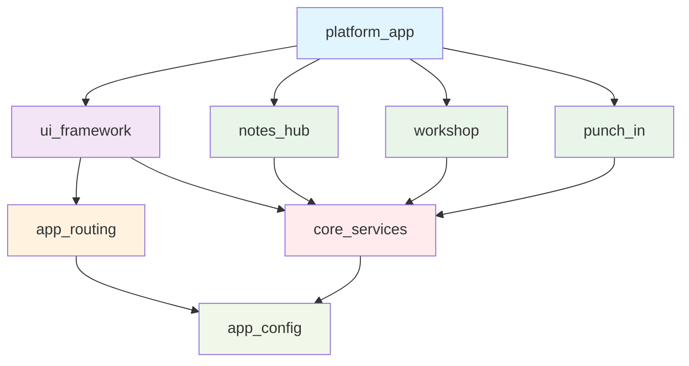

# PetApp Phase 1.5 架构文档

## 文档信息
- **版本**: Phase 1.5
- **创建日期**: 2025-06-26
- **最后更新**: 2025-06-26
- **作者**: Ig
- **状态**: 完成

## 概述

本文档详细描述了PetApp在Phase 1.5阶段进行的深度架构重构，从单体应用转换为包驱动的模块化架构，并集成了国际化支持和核心基础设施增强。

## 架构演进历程

### Phase 1 → Phase 1.5 重构动机

**原有架构问题**：
- 单体应用结构，代码耦合度高
- 缺乏模块化隔离，难以独立开发和测试
- 硬编码字符串，不支持国际化
- 缺乏统一的基础服务框架
- 主题系统功能有限

**重构目标**：
- 建立包驱动的Monorepo架构
- 实现模块化解耦和清晰的依赖层次
- 集成完整的国际化(i18n)支持
- 构建企业级基础服务框架
- 增强主题系统的可定制性

## 新架构设计

### 1. Monorepo目录结构

```
pet_app/
├── packages/               # 共享包目录
│   ├── app_config/        # 应用配置包
│   ├── core_services/     # 核心服务包
│   ├── app_routing/       # 路由管理包
│   ├── ui_framework/      # UI框架包
│   ├── notes_hub/         # 笔记中心模块包
│   ├── workshop/          # 创意工坊模块包
│   └── punch_in/          # 打卡模块包
├── apps/                  # 应用目录
│   └── platform_app/      # 主应用
└── docs/                  # 文档目录
```

### 2. 包层次依赖架构



**依赖层次说明**：
1. **底层**: `app_config` - 应用配置和常量
2. **核心层**: `core_services` - 依赖注入、事件总线、基础服务
3. **功能层**: `app_routing` - 路由管理
4. **UI层**: `ui_framework` - UI组件和主题系统
5. **业务层**: `notes_hub`, `workshop`, `punch_in` - 业务模块
6. **应用层**: `platform_app` - 主应用入口

### 3. 核心包详细设计

#### 3.1 app_config包
**职责**: 应用配置管理
- 环境配置
- 常量定义
- 配置加载和验证

#### 3.2 core_services包
**职责**: 核心服务框架
- **依赖注入系统**: `ServiceLocator`
- **事件总线**: 模块间通信
- **模块管理**: `ModuleManager`
- **日志服务**: `LoggingService`
- **错误处理**: `ErrorHandlingService`
- **性能监控**: `PerformanceMonitoringService`

**关键设计决策**：
```dart
// 服务定位器模式
class ServiceLocator {
  static final ServiceLocator _instance = ServiceLocator._internal();
  static ServiceLocator get instance => _instance;
  
  void registerSingleton<T>(T service);
  T get<T>();
}

// 模块接口设计
abstract class ModuleInterface {
  Future<void> initialize();
  Widget createWidget();
  void dispose();
}
```

#### 3.3 app_routing包
**职责**: 路由管理
- 声明式路由配置
- 路由拦截和权限控制
- 深链接支持

#### 3.4 ui_framework包
**职责**: UI框架和主题系统
- **应用框架**: `PetApp`
- **主布局**: `MainShell`
- **导航组件**: `AdaptiveNavigationDrawer`
- **主题服务**: `ThemeService`

**主题系统架构**：
```dart
// 主题配置数据类
class ThemeConfig {
  final AppThemeMode themeMode;           // 浅色/深色/跟随系统
  final ColorSchemeType colorSchemeType;  // 8种内置配色方案
  final FontStyleType fontStyleType;      // 3种字体样式
  final double fontScale;                 // 字体缩放
  final bool enableAnimations;            // 动画控制
}

// 主题服务接口
abstract class ThemeService {
  Future<void> setThemeMode(AppThemeMode mode);
  Future<void> setColorScheme(ColorSchemeType type);
  Stream<ThemeConfig> get themeChanges;
}
```

#### 3.5 业务模块包
**设计原则**：
- 每个模块独立打包
- 统一的模块接口
- 清晰的生命周期管理

## 国际化架构设计

### 1. i18n基础设置
```yaml
# l10n.yaml
arb-dir: lib/l10n
template-arb-file: app_zh.arb
output-localization-file: app_localizations.dart
```

### 2. 资源文件结构
```
lib/l10n/
├── app_zh.arb     # 中文资源
└── app_en.arb     # 英文资源
```

### 3. 本地化集成
```dart
MaterialApp.router(
  localizationsDelegates: const [
    GlobalMaterialLocalizations.delegate,
    GlobalWidgetsLocalizations.delegate,
    AppLocalizations.delegate,
  ],
  supportedLocales: const [
    Locale('zh', 'CN'),
    Locale('en', 'US'),
  ],
)
```

## 技术选型与决策

### 1. 包管理策略
**选择**: Monorepo + path依赖
**理由**:
- 便于跨包代码共享和重构
- 统一的版本管理
- 简化CI/CD流程
- 降低开发复杂度

### 2. 依赖注入模式
**选择**: Service Locator模式
**理由**:
- Flutter生态兼容性好
- 实现简单，性能优秀
- 支持单例和工厂模式
- 便于测试和mock

### 3. 状态管理
**选择**: 基于Stream的响应式架构
**理由**:
- 原生Dart支持，无额外依赖
- 与Flutter框架深度集成
- 支持异步数据流
- 便于调试和测试

### 4. 路由管理
**选择**: go_router
**理由**:
- 声明式路由配置
- 深链接支持
- 类型安全
- 官方推荐方案

## 关键架构模式

### 1. 模块化模式
```dart
// 统一的模块接口
abstract class ModuleInterface {
  String get name;
  String get version;
  Future<void> initialize();
  Widget createWidget();
  void dispose();
}

// 模块注册和管理
class ModuleManager {
  void registerModule(String id, ModuleInterface module);
  List<ModuleMetadata> getAllModules();
  Stream<ModuleLifecycleEvent> get lifecycleEvents;
}
```

### 2. 服务定位器模式
```dart
// 统一的服务访问入口
class ServiceLocator {
  static void registerSingleton<T>(T service);
  static T get<T>();
  static bool isRegistered<T>();
}
```

### 3. 主题管理模式
```dart
// 主题数据与逻辑分离
class ThemeService {
  ThemeConfig get currentConfig;
  AppThemeData get currentTheme;
  Stream<ThemeConfig> get themeChanges;
}

// 主题状态管理
class ThemeProvider extends StatefulWidget {
  static ThemeService of(BuildContext context);
}
```

### 4. 错误处理模式
```dart
// 分层错误处理
abstract class ErrorHandler {
  bool canHandle(AppException error);
  Future<bool> handle(AppException error);
}

// 错误恢复策略
abstract class ErrorRecoveryStrategy {
  bool canRecover(AppException error);
  Future<bool> recover(AppException error);
}
```

## 性能优化策略

### 1. 包加载优化
- 按需加载业务模块
- 懒加载非核心服务
- 异步初始化

### 2. 内存管理
- 及时释放不用的服务
- 模块生命周期管理
- 弱引用避免内存泄漏

### 3. 渲染优化
- 主题热切换避免重建整个Widget树
- 局部状态管理减少重绘范围
- 异步操作避免阻塞UI线程

## 可扩展性设计

### 1. 新模块添加
```bash
# 1. 创建新的包目录
mkdir packages/new_module

# 2. 实现ModuleInterface
class NewModule implements ModuleInterface {
  // 实现接口方法
}

# 3. 注册到ModuleManager
ModuleManager.instance.registerModule('new_module', NewModule());
```

### 2. 新服务集成
```dart
// 1. 定义服务接口
abstract class NewService {
  Future<void> doSomething();
}

// 2. 实现服务
class BasicNewService implements NewService {
  // 实现逻辑
}

// 3. 注册服务
ServiceLocator.registerSingleton<NewService>(BasicNewService());
```

### 3. 主题扩展
```dart
// 1. 扩展颜色方案
enum ColorSchemeType {
  // 现有方案...
  newColorScheme;
}

// 2. 扩展字体样式
enum FontStyleType {
  // 现有样式...
  newFontStyle;
}
```

## 测试策略

### 1. 单元测试
- 每个包独立测试
- Mock外部依赖
- 覆盖核心业务逻辑

### 2. 集成测试
- 跨包交互测试
- 端到端流程验证
- 性能基准测试

### 3. Widget测试
- UI组件独立测试
- 主题切换测试
- 响应式布局测试

## 部署与CI/CD

### 1. 构建流程
```yaml
# 简化的CI流程
name: Build and Test
on: [push, pull_request]
jobs:
  test:
    runs-on: ubuntu-latest
    steps:
      - uses: actions/checkout@v3
      - uses: subosito/flutter-action@v2
      - run: flutter pub get
      - run: flutter test
      - run: flutter build apk
```

### 2. 版本管理
- 主应用版本号统一管理
- 包版本号独立维护
- 语义化版本控制

## 监控与运维

### 1. 性能监控
```dart
// 集成性能监控服务
final performanceService = ServiceLocator.get<PerformanceMonitoringService>();
final timer = performanceService.startTimer('operation_name');
// 执行业务逻辑
timer.stopAndCreateMetric();
```

### 2. 错误监控
```dart
// 统一错误处理和上报
final errorService = ServiceLocator.get<ErrorHandlingService>();
await errorService.handleNetworkError('Network request failed');
```

### 3. 日志管理
```dart
// 结构化日志记录
final logger = ServiceLocator.get<LoggingService>();
logger.info('User action completed', tag: 'UserFlow', data: {'userId': '123'});
```

## 未来演进方向

### 1. 微前端架构
- 支持动态模块加载
- 模块独立部署
- 运行时模块管理

### 2. 多平台适配
- Web端优化
- 桌面端支持
- 原生集成

### 3. 云原生集成
- 远程配置管理
- 云端主题同步
- 分布式日志收集

## 总结

Phase 1.5架构重构成功实现了从单体应用到包驱动模块化架构的转变，建立了：

1. **清晰的包层次依赖关系**
2. **完整的基础服务框架**
3. **灵活的主题系统**
4. **全面的国际化支持**
5. **可扩展的模块化设计**

这为PetApp的后续发展奠定了坚实的技术基础，支持快速迭代和功能扩展。 